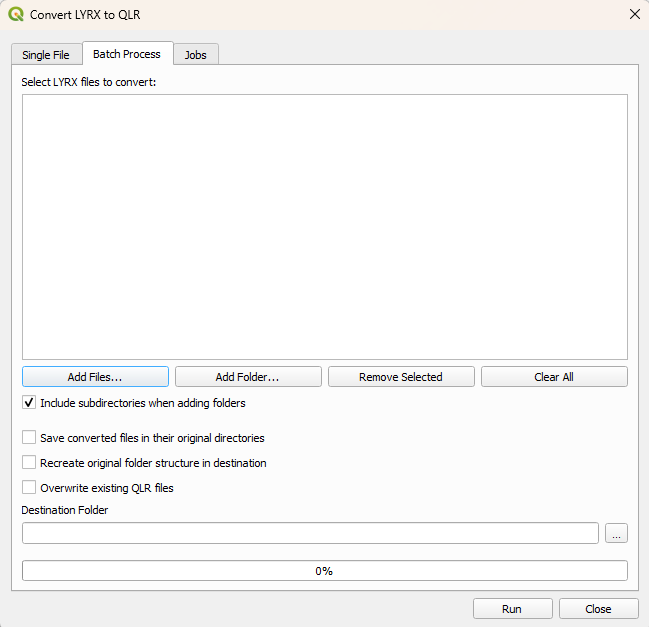
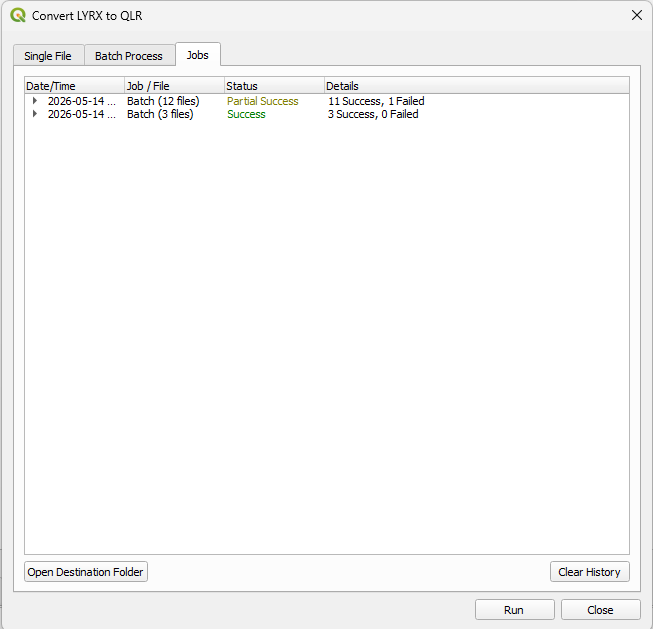

# ArcToQ

Python package to convert from ArcGIS to QGIS

ArcToQ converts ArcGIS formats (currently only LYRX) to QGIS-compatible equivalents.

This project is in its early stages, so don't expect working code of files that make sense yet.

## Features

- Convert ArcGIS Pro layer files (LYRX) to QGIS layer files (QLR)
- View and manage conversion history and error logs directly within QGIS
- You can request additional features in the [Issues tab](https://github.com/Gulf-Basin-Depositional-Synthesis/ArcToQ/issues)

## Known Limitations
 
The following are not currently supported. Consider supporting development or contributing to the codebase.
 
**File Formats**
- `.aprx` project files, only `.lyrx` layer files are supported
- `.lyr` (legacy ArcMap layer files)

**Layer Types**
- Annotation layers

**Features**
- Esri fonts if not installed
- If the source gdb is compressed it will not convert

## Requirements

- QGIS version 3.40 or greater (for PyQGIS)

# How To

You can either use the native QGIS plugin or run the layer converter from the QGIS Python environment.

## **QGIS Plugin**

### 1. Install the Plugin

**Method A: Install via QGIS Plugin Repository (Easiest)**
1. Open **QGIS**.
2. From the top menu, go to **Plugins > Manage and Install Plugins...**
3. Select the **All** or **Not installed** tab on the left panel.
4. Search for **ArcToQ** in the search bar.
5. Select the plugin and click **Install Plugin**.

**Method B: Install from ZIP**
1. Download the latest **`ArcToQ.zip`** file from the [Releases page](https://github.com/Gulf-Basin-Depositional-Synthesis/ArcToQ/releases)
2. Open **QGIS**.
3. From the top menu, go to **Plugins > Manage and Install Plugins...**  
4. Select the **Install from ZIP** tab on the left panel.
5. Click the `...` button to browse for the `ArcToQ.zip` file you downloaded, and click **Install Plugin**.  
    

### 2. Convert a Layer
1. Click the new  button on your QGIS toolbar (you can also find it under the `Plugins` menu at the top).
2. A file browser will open. Select the ArcGIS `.lyrx` file you want to convert.
3. Choose the output directory where you want the new `.qlr` file to be saved.  
    
4. The converter will run. Once finished, a prompt will appear asking if you want to instantly load the converted layer directly into your current active map canvas.

### 3. Batch Convert
1. Open the ArcToQ plugin and switch to the **Batch Process** tab.
2. Click **Add Files...** to select multiple `.lyrx` files, or use the list buttons to manage your queue.
    
3. Choose your output directory:

    Check **Save converted files in their original directories** to save each `.qlr` alongside its source file.

    OR leave it unchecked and select a specific **Destination Directory** to route all outputs to a single folder.

4. Click **Run**. A progress bar will track the conversion.
5. Once finished, a summary will display any errors, and you will have the option to load all successfully converted layers into your current project.

### 4. View Job History
1. Switch to the **Jobs** tab to view a persistent history of your single and batch conversions.
2. You can expand batch jobs to see the success or failure status of individual files.
3. Double-click on any entry to open a pop-up with the full file path or error message.
4. Select a successful conversion and click **Open Destination Folder** to easily locate your new `.qlr` files in your file explorer.
    

## **QGIS Python Environment**

In this example, for Windows:

1. Start PowerShell.
2. `cd` to the **ArcToQ** folder.
3. Run your test script, e.g., `& "C:\Program Files\QGIS 3.40.15\bin\python-qgis-ltr.bat" .\tests\tim_test.py`
