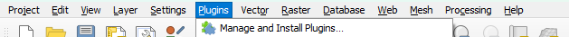
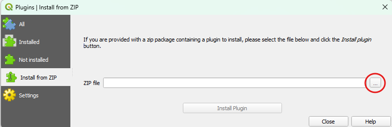
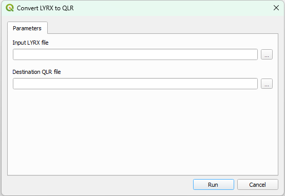

# ArcToQ

Python package to convert from ArcGIS to QGIS

ArcToQ converts ArcGIS formats (currently only LYRX) to QGIS-compatible equivalents.

This project is in its early stages, so don't expect working code of files that make sense yet.

## Features

- Convert ArcGIS Pro layer files (LYRX) to QGIS layer files (QLR)
- You can request additional features in the [Issues tab](https://github.com/Gulf-Basin-Depositional-Synthesis/ArcToQ/issues)

## Requirements

- QGIS version 3.40 or greater (for PyQGIS)

# How To

You can either use the native QGIS plugin or run the layer converter from the QGIS Python environment

## **QGIS Plugin**

### 1. Install the Plugin
1. Download the latest **`ArcToQ.zip`** file from the [Releases page](https://github.com/Gulf-Basin-Depositional-Synthesis/ArcToQ/releases)
2. Open **QGIS**.
3. From the top menu, go to **Plugins > Manage and Install Plugins...**  
 
4. Select the **Install from ZIP** tab on the left panel.
5. Click the `...` button to browse for the `ArcToQ.zip` file you downloaded, and click **Install Plugin**.  

### 2. Convert a Layer
1. Click the new  button on your QGIS toolbar (you can also find it under the `Plugins` menu at the top).
2. A file browser will open. Select the ArcGIS `.lyrx` file you want to convert.
3. Choose the output directory where you want the new `.qlr` file to be saved.  

4. The converter will run safely in the background. Once finished, a prompt will appear asking if you want to instantly load the converted layer directly into your current active map canvas.

## **QGIS Python Environment**

In this example, for Windows:

1. Start PowerShell.
2. cd to the **ArcToQ** folder.
3. Run your test script, e.g., `& "C:\Program Files\QGIS 3.40.15\bin\python-qgis-ltr.bat" .\tests\tim_test.py`
